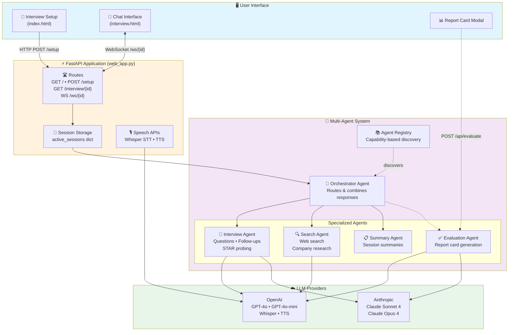
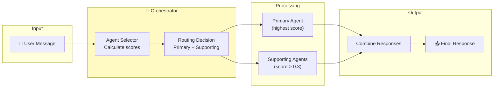
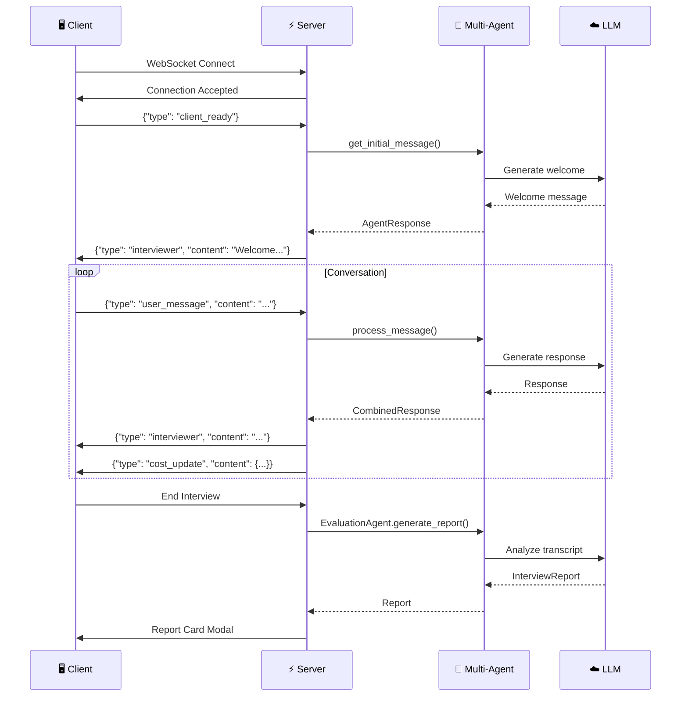
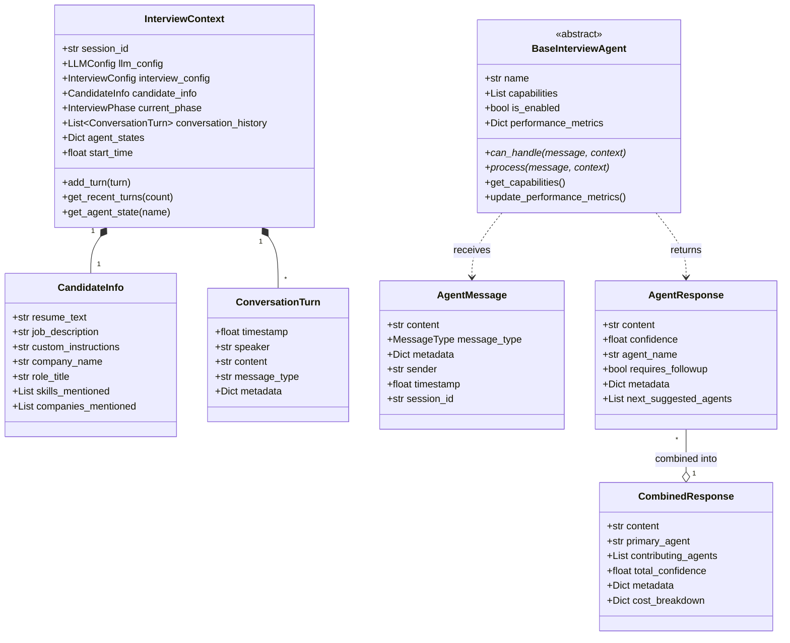
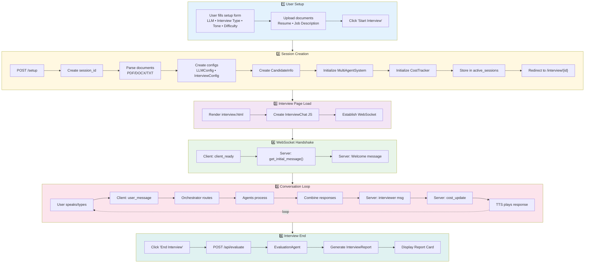
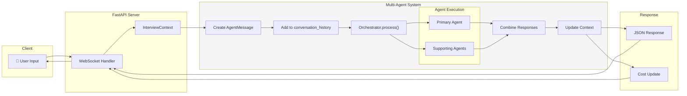

# AI Interviewer - Complete Architecture Guide

This document provides a comprehensive explanation of how the AI Mock Interview Coach repository works. It covers the system architecture, data flow, component interactions, and implementation details.

---

## Table of Contents

1. [Overview](#overview)
2. [System Architecture](#system-architecture)
3. [Project Structure](#project-structure)
4. [Core Components](#core-components)
   - [Web Application Layer](#web-application-layer)
   - [Multi-Agent System](#multi-agent-system)
   - [Agent Implementations](#agent-implementations)
   - [Core Data Structures](#core-data-structures)
5. [Data Flow](#data-flow)
6. [Configuration System](#configuration-system)
7. [Prompt Engineering](#prompt-engineering)
8. [Frontend Architecture](#frontend-architecture)
9. [Cost Tracking](#cost-tracking)
10. [Testing](#testing)
11. [Extending the System](#extending-the-system)

---

## Overview

The AI Mock Interview Coach is a full-stack application that simulates realistic job interviews using AI. It supports:

- **Behavioral interviews**: Questions about past experiences using the STAR method
- **Case study interviews**: Hypothetical business problems to solve

The system uses a **multi-agent architecture** where specialized AI agents collaborate to conduct interviews, perform research, and generate evaluations.

### Key Technologies

| Component | Technology |
|-----------|------------|
| Backend | FastAPI (Python) |
| AI Framework | pydantic-ai |
| LLM Providers | OpenAI (GPT-4o), Anthropic (Claude) |
| Frontend | Vanilla JavaScript, HTML, CSS |
| Communication | WebSockets |
| Speech | OpenAI Whisper (STT), TTS API |
| Search | DuckDuckGo (ddgs) |

---

## System Architecture

> **Note:** To render these diagrams in VS Code, install the [Markdown Preview Mermaid Support](https://marketplace.visualstudio.com/items?itemName=bierner.markdown-mermaid) extension. GitHub and GitLab render Mermaid natively.

### High-Level Architecture



### Agent Routing Detail



### WebSocket Communication



---

## Project Structure

```
ai-interviewer/
├── web_app.py                 # FastAPI application entry point
├── run.py                     # Alternative runner
├── pyproject.toml             # Poetry dependencies and config
├── .env_example               # Environment variable template
│
├── interviewer/               # Main application package
│   ├── __init__.py
│   ├── multi_agent_system.py  # Multi-agent orchestration
│   ├── config.py              # Configuration models (LLM, Interview)
│   ├── prompts.py             # All AI prompts (customizable!)
│   ├── cost_tracker.py        # API cost monitoring
│   ├── document_parser.py     # Resume/JD parsing utilities
│   │
│   ├── agents/                # Agent implementations
│   │   ├── __init__.py        # Exports all agents
│   │   ├── base.py            # Abstract base agent class
│   │   ├── interview.py       # Primary interview agent
│   │   ├── search.py          # Web search agent
│   │   ├── summary.py         # Session summary agent
│   │   ├── evaluation.py      # Report card generation
│   │   ├── orchestrator.py    # Agent coordination
│   │   └── registry.py        # Agent discovery/management
│   │
│   ├── core/                  # Core data structures
│   │   ├── __init__.py        # Exports all core types
│   │   ├── context.py         # InterviewContext, CandidateInfo
│   │   ├── messaging.py       # AgentMessage, AgentResponse
│   │   └── routing.py         # AgentSelector, RoutingDecision
│   │
│   └── tools/                 # External tools/integrations
│       ├── __init__.py
│       └── web_search.py      # DuckDuckGo search integration
│
├── templates/                 # Jinja2 HTML templates
│   ├── base.html              # Base template with common styles
│   ├── index.html             # Setup page
│   └── interview.html         # Interview chat interface
│
├── static/                    # Static assets
│   ├── css/style.css          # Application styles
│   └── js/
│       ├── main.js            # Common JavaScript utilities
│       └── interview.js       # Interview chat functionality
│
├── tests/                     # Test suite
│   ├── __init__.py
│   ├── conftest.py            # Shared fixtures
│   ├── test_agent_base.py     # Agent base class tests
│   ├── test_config.py         # Configuration tests
│   ├── test_interview_agent.py# Interview agent tests
│   └── test_prompts.py        # Prompt building tests
│
└── .github/workflows/
    └── test.yml               # CI/CD pipeline
```

---

## Core Components

### Web Application Layer

The web application (`web_app.py`) is built with **FastAPI** and handles:

#### Session Management

```python
# In-memory session storage
active_sessions: Dict[str, Dict] = {}

# Each session contains:
{
    "llm_config": LLMConfig,           # LLM provider/model settings
    "interview_config": InterviewConfig, # Interview type/tone/difficulty
    "candidate_info": CandidateInfo,    # Resume, JD, company info
    "interview_system": MultiAgentInterviewSystem,  # Agent system
    "cost_tracker": CostTracker,        # API cost monitoring
    "messages": [],                     # Conversation history
    "tts_enabled": bool,                # Voice synthesis enabled
    "tts_voice": str,                   # Selected voice
}
```

#### Key Routes

| Route | Method | Description |
|-------|--------|-------------|
| `/` | GET | Render setup page with configuration options |
| `/setup` | POST | Process setup form, create session, redirect to interview |
| `/interview/{session_id}` | GET | Render interview chat interface |
| `/ws/{session_id}` | WebSocket | Real-time chat communication |
| `/api/evaluate-session/{session_id}` | POST | Generate post-interview report |
| `/api/whisper-transcribe` | POST | Transcribe audio with Whisper |
| `/api/tts-synthesize` | POST | Generate speech from text |

#### WebSocket Message Flow

```python
# Client sends message:
{
    "type": "user_message",
    "content": "In my previous role, I led a team of 5 engineers...",
    "timestamp": "2024-01-15T10:30:00Z"
}

# Server processes through multi-agent system and responds:
{
    "type": "interviewer",
    "content": "That's great experience! Can you tell me about a specific challenge...",
    "timestamp": "2024-01-15T10:30:05Z"
}

# Server also sends cost updates:
{
    "type": "cost_update",
    "content": {
        "total_cost_usd": 0.0234,
        "token_stats": {"input_tokens": 450, "output_tokens": 120}
    }
}
```

---

### Multi-Agent System

The `MultiAgentInterviewSystem` class orchestrates multiple specialized agents to conduct interviews.

#### Initialization Flow

```python
def __init__(self, llm_config: LLMConfig, interview_config: InterviewConfig):
    # 1. Create agent registry
    self.agent_registry = AgentRegistry()
    
    # 2. Create specialized agents
    self.interview_agent = InterviewAgent(llm_config, interview_config)
    self.search_agent = SearchAgent(llm_config)
    self.summary_agent = SummaryAgent()
    
    # 3. Register agents with registry
    self.agent_registry.register_agent(self.interview_agent)
    self.agent_registry.register_agent(self.search_agent)
    self.agent_registry.register_agent(self.summary_agent)
    
    # 4. Create orchestrator for coordination
    self.orchestrator = OrchestratorAgent(self.agent_registry)
```

#### Message Processing Flow

```python
async def process_message(self, user_message: str, context: InterviewContext):
    # 1. Create agent message
    agent_message = AgentMessage(
        sender="user",
        content=user_message,
        message_type=MessageType.USER_RESPONSE,
        ...
    )
    
    # 2. Add to conversation history
    context.add_turn(...)
    
    # 3. Process through orchestrator
    combined_response = await self.orchestrator.process(agent_message, context)
    
    # 4. Add response to history and return
    return {
        "primary_response": AgentResponse(...),
        "feedback_data": combined_response.feedback_data,
        "metadata": {...}
    }
```

---

### Agent Implementations

#### Base Agent Class

All agents inherit from `BaseInterviewAgent`:

```python
class BaseInterviewAgent(ABC):
    def __init__(self, name: str, capabilities: List[AgentCapability], ...):
        self.name = name
        self.capabilities = capabilities
        self.is_enabled = True
        self.performance_metrics = {
            "total_requests": 0,
            "successful_responses": 0,
            "average_confidence": 0.0,
            "average_response_time": 0.0,
        }
    
    @abstractmethod
    def can_handle(self, message: AgentMessage, context: InterviewContext) -> float:
        """Return confidence score (0.0-1.0) for handling this message."""
        pass
    
    @abstractmethod
    async def process(self, message: AgentMessage, context: InterviewContext) -> AgentResponse:
        """Process message and generate response."""
        pass
```

#### Interview Agent

The primary agent responsible for conducting interviews. Uses **pydantic-ai** for structured LLM interactions.

**Key Features:**

1. **Dynamic system prompts** based on interview type (behavioral vs case study)
2. **Context management** - maintains conversation history across turns
3. **Smart initial context building** - uses resume, JD, company info to personalize

```python
class InterviewAgent(BaseInterviewAgent):
    def __init__(self, llm_config: LLMConfig, interview_config: InterviewConfig):
        super().__init__(
            name="interview",
            capabilities=[
                AgentCapability.INTERVIEW_QUESTIONS,
                AgentCapability.CONVERSATION_FLOW,
            ],
        )
        
        # Initialize pydantic-ai agent with dynamic prompts
        self._initialize_agent(llm_config, interview_config)
    
    async def process(self, message: AgentMessage, context: InterviewContext):
        # Build dependencies with interview context
        deps = InterviewDeps(
            interview_type=context.interview_config.interview_type.value,
            tone=context.interview_config.tone.value,
            difficulty=context.interview_config.difficulty.value,
            company_name=context.candidate_info.company_name,
            role_title=context.candidate_info.role_title,
            resume_summary=context.candidate_info.resume_text[:1500],
            jd_summary=context.candidate_info.job_description[:1500],
            ...
        )
        
        # Run pydantic-ai agent with message history for context
        result = await self.pydantic_agent.run(
            message.content,
            deps=deps,
            message_history=self.pydantic_message_history
        )
        
        # Update message history for next turn
        self.pydantic_message_history = result.all_messages()
        
        return self._create_response(content=result.output, confidence=0.9)
```

#### Search Agent

Performs web searches to provide current information about companies, technologies, and trends.

**Capabilities:**
- Company information lookup
- Current technology trends
- Interview topic research
- General web search

```python
class SearchAgent(BaseInterviewAgent):
    def __init__(self, llm_config: LLMConfig):
        super().__init__(
            "search",
            [AgentCapability.WEB_SEARCH, AgentCapability.RESEARCH],
        )
        
        # Create pydantic-ai agent with search tools
        self.pydantic_agent = Agent(model, system_prompt=...)
        self._register_search_tools()
    
    def _register_search_tools(self):
        @self.pydantic_agent.tool_plain
        def search_company_info_tool(company_name: str) -> str:
            """Search for company information."""
            results = search_company_info(company_name)
            return format_results(results)
        
        @self.pydantic_agent.tool_plain
        def search_current_trends_tool(technology: str) -> str:
            """Search for technology trends."""
            results = search_current_trends(technology)
            return format_results(results)
```

#### Orchestrator Agent

Routes messages to appropriate agents and combines their responses.

**Routing Logic:**

```python
def _calculate_agent_scores(self, message: AgentMessage, context: InterviewContext):
    scores = {"interview": 0.0, "feedback": 0.0, "summary": 0.0, "search": 0.0}
    
    # Interview agent handles most user responses
    if message.message_type.value == "user_response":
        scores["interview"] = 0.9
    
    # Search agent handles company/fact-finding questions
    if "who is" in content_lower or "what is" in content_lower:
        scores["search"] = 0.8
    
    # Summary agent handles summary requests
    if message.message_type.value == "summary_request":
        scores["summary"] = 0.9
    
    return scores
```

**Response Combination:**

```python
def _combine_responses(self, agent_responses: List[AgentResponse], ...):
    # Find primary response
    primary_response = None
    for response in agent_responses:
        if response.agent_name == routing_decision.primary_agent:
            primary_response = response
    
    # Calculate combined confidence
    total_confidence = sum(r.confidence for r in agent_responses) / len(agent_responses)
    
    return CombinedResponse(
        content=primary_response.content,
        primary_agent=routing_decision.primary_agent,
        contributing_agents=[r.agent_name for r in agent_responses],
        total_confidence=total_confidence,
    )
```

#### Evaluation Agent

Generates comprehensive post-interview reports using structured output.

```python
class InterviewReport(BaseModel):
    """Structured evaluation report."""
    score: int = Field(description="Overall score from 0 to 10")
    summary: str = Field(description="Executive summary")
    strengths: List[str] = Field(description="Demonstrated strengths")
    improvements: List[str] = Field(description="Areas for improvement")
    communication_assessment: str
    cultural_fit_assessment: str
    technical_assessment: Optional[str] = None

class EvaluationAgent(BaseInterviewAgent):
    async def generate_report(self, context: InterviewContext) -> InterviewReport:
        # Format transcript from conversation history
        transcript = []
        for turn in context.conversation_history:
            speaker = turn.get("speaker", "unknown")
            content = turn.get("content", "")
            transcript.append(f"{speaker.upper()}: {content}")
        
        # Generate evaluation with LLM
        result = await self.pydantic_agent.run(
            f"Analyze this interview:\n{full_transcript}"
        )
        
        # Parse JSON response into InterviewReport
        return InterviewReport(**json.loads(result.output))
```

---

### Core Data Structures



#### InterviewContext

Central data structure maintaining complete interview state:

```python
@dataclass
class InterviewContext:
    session_id: str
    llm_config: LLMConfig
    interview_config: InterviewConfig
    candidate_info: CandidateInfo
    
    # State management
    current_phase: InterviewPhase = InterviewPhase.STARTING
    conversation_history: List[ConversationTurn] = field(default_factory=list)
    agent_states: Dict[str, Any] = field(default_factory=dict)
    start_time: float = field(default_factory=time.time)
    
    def add_turn(self, turn: ConversationTurn):
        """Add a conversation turn to history."""
        self.conversation_history.append(turn)
    
    def get_recent_turns(self, count: int = 5) -> List[ConversationTurn]:
        """Get most recent conversation turns."""
        return self.conversation_history[-count:]
```

#### Agent Messages

```python
@dataclass
class AgentMessage:
    content: str
    message_type: MessageType  # USER_RESPONSE, SYSTEM_EVENT, etc.
    metadata: Dict[str, Any]
    sender: str  # "user", "system", agent name
    timestamp: float
    session_id: str

@dataclass
class AgentResponse:
    content: str
    confidence: float  # 0.0 to 1.0
    agent_name: str
    requires_followup: bool = False
    metadata: Dict[str, Any] = None
    next_suggested_agents: List[str] = None
```

#### Agent Capabilities

```python
class AgentCapability(Enum):
    INTERVIEW_QUESTIONS = "interview_questions"
    CONVERSATION_FLOW = "conversation_flow"
    TECHNICAL_ASSESSMENT = "technical_assessment"
    BEHAVIORAL_ASSESSMENT = "behavioral_assessment"
    CASE_STUDY_FACILITATION = "case_study_facilitation"
    FEEDBACK_ANALYSIS = "feedback_analysis"
    PERFORMANCE_SCORING = "performance_scoring"
    SUMMARY_GENERATION = "summary_generation"
    WEB_SEARCH = "web_search"
    RESEARCH = "research"
    INFORMATION_GATHERING = "information_gathering"
```

---

## Data Flow

### Complete Interview Flow



### Message Processing Detail



---

## Configuration System

### LLM Configuration

```python
class LLMProvider(str, Enum):
    OPENAI = "openai"
    ANTHROPIC = "anthropic"

class LLMConfig(BaseModel):
    provider: LLMProvider = LLMProvider.OPENAI
    api_key: Optional[str] = None  # Uses env var if not provided
    model: str = "gpt-3.5-turbo"
    temperature: float = Field(default=0.7, ge=0.0, le=2.0)
    max_tokens: int = Field(default=1000, gt=0)

# Available models
PROVIDER_MODELS = {
    LLMProvider.OPENAI: ["gpt-4o", "gpt-4o-mini", "gpt-4-turbo", "gpt-4", "gpt-3.5-turbo"],
    LLMProvider.ANTHROPIC: ["claude-sonnet-4-20250514", "claude-opus-4-20250514", ...],
}
```

### Interview Configuration

```python
class InterviewType(str, Enum):
    BEHAVIORAL = "behavioral"  # Past experiences, STAR method
    CASE_STUDY = "case_study"  # Hypothetical problem-solving

class Tone(str, Enum):
    PROFESSIONAL = "professional"
    FRIENDLY = "friendly"
    CHALLENGING = "challenging"
    SUPPORTIVE = "supportive"

class Difficulty(str, Enum):
    EASY = "easy"
    MEDIUM = "medium"
    HARD = "hard"

class InterviewConfig(BaseModel):
    interview_type: InterviewType = InterviewType.BEHAVIORAL
    tone: Tone = Tone.PROFESSIONAL
    difficulty: Difficulty = Difficulty.MEDIUM
```

---

## Prompt Engineering

All prompts are centralized in `interviewer/prompts.py` for easy customization.

### Base Prompt

```python
BASE_PROMPT = """You are an experienced interviewer conducting a realistic interview.

CRITICAL FORMATTING RULES:
- NEVER use markdown formatting (no **, no *, no bullet points)
- Write in natural spoken language
- Your responses will be read aloud by text-to-speech

CONVERSATIONAL STYLE:
- React naturally to candidate responses
- Express genuine curiosity about strengths
- Show skepticism about mismatches or vague claims
- Question irrelevant experience directly
- Never repeat questions
- Avoid formulaic praise"""
```

### Tone Modifiers

```python
TONE_MODIFIERS = {
    "professional": "Maintain a formal, business-appropriate demeanor.",
    "friendly": "Be warm and encouraging while remaining professional.",
    "challenging": "Be direct and probe deeply into responses.",
    "supportive": "Be patient and help candidates articulate their thoughts.",
}
```

### Difficulty Modifiers

```python
DIFFICULTY_MODIFIERS = {
    "easy": """
DIFFICULTY: Easy
- Ask straightforward questions with clear scope
- Accept general answers and help candidates elaborate
- Provide encouragement and gentle guidance""",
    
    "medium": """
DIFFICULTY: Medium
- Ask moderately detailed questions
- Expect specific examples with some follow-up
- Balance support with appropriate challenge""",
    
    "hard": """
DIFFICULTY: Hard
- Ask probing, multi-layered questions
- Challenge vague or generic responses
- Expect detailed examples with strong evidence
- Press on inconsistencies, gaps, or mismatches""",
}
```

### Interview Type Guidance

```python
INTERVIEW_TYPE_GUIDANCE = {
    "behavioral": """
INTERVIEW TYPE: Behavioral
Focus ONLY on the candidate's PAST experiences.
- Ask "Tell me about a time when..." questions
- Reference their resume to ask about specific projects
- Probe how their experience aligns with job requirements
- DO NOT present hypothetical scenarios
- USE STAR METHOD TO PROBE (Situation, Task, Action, Result)""",

    "case_study": """
INTERVIEW TYPE: Case Study
Present a brief hypothetical problem.
CRITICAL: Keep your opening SHORT - just 2-3 sentences!
- DO NOT list all available data upfront
- Let details emerge as the candidate asks questions
- DO NOT ask about their past projects or resume
- Guide them through problem-solving collaboratively""",
}
```

### Building Complete Prompts

```python
def build_system_prompt(interview_type: str, tone: str, difficulty: str) -> str:
    return f"""{BASE_PROMPT}

{TONE_MODIFIERS.get(tone, TONE_MODIFIERS['professional'])}

{INTERVIEW_TYPE_GUIDANCE.get(interview_type, INTERVIEW_TYPE_GUIDANCE['behavioral'])}

{DIFFICULTY_MODIFIERS.get(difficulty, DIFFICULTY_MODIFIERS['medium'])}"""
```

---

## Frontend Architecture

### Interview Chat Class

The `InterviewChat` class (`static/js/interview.js`) manages all client-side functionality:

```javascript
class InterviewChat {
    constructor(sessionId) {
        this.sessionId = sessionId;
        this.ws = null;
        this.isConnected = false;
        
        // DOM elements
        this.chatMessages = document.getElementById('chat-messages');
        this.messageInput = document.getElementById('message-input');
        
        // Speech recognition
        this.recognition = null;
        this.isListening = false;
        
        // Voice synthesis
        this.voiceEnabled = true;
        this.currentSpeech = null;
        
        this.init();
    }
    
    init() {
        this.setupWebSocket();
        this.setupEventListeners();
        this.setupSpeechRecognition();
        this.setupVoiceSynthesis();
    }
}
```

### WebSocket Communication

```javascript
setupWebSocket() {
    const protocol = window.location.protocol === 'https:' ? 'wss:' : 'ws:';
    const wsUrl = `${protocol}//${window.location.host}/ws/${this.sessionId}`;
    
    this.ws = new WebSocket(wsUrl);
    
    this.ws.onopen = () => {
        this.isConnected = true;
        this.syncTtsSettingsOnConnect();  // Sync TTS settings first
        // Then send client_ready to receive initial message
    };
    
    this.ws.onmessage = (event) => {
        const data = JSON.parse(event.data);
        this.handleMessage(data);
    };
}

handleMessage(data) {
    switch (data.type) {
        case 'interviewer':
            this.addMessageToChat('interviewer', data.content);
            this.speakText(data.content);  // TTS
            break;
        case 'cost_update':
            this.updateCostDisplay(data.content);
            break;
        case 'error':
            this.addMessageToChat('error', data.content);
            break;
    }
}
```

### Speech Features

**Speech-to-Text (Web Speech API + Whisper):**

```javascript
setupSpeechRecognition() {
    const SpeechRecognition = window.SpeechRecognition || window.webkitSpeechRecognition;
    this.recognition = new SpeechRecognition();
    this.recognition.continuous = true;
    this.recognition.interimResults = true;
    
    this.recognition.onresult = (event) => {
        let transcript = '';
        for (let i = event.resultIndex; i < event.results.length; i++) {
            transcript += event.results[i][0].transcript;
        }
        this.messageInput.value = transcript;
    };
}

// Optional: Refine with Whisper for higher accuracy
async transcribeWithWhisper() {
    const audioBlob = new Blob(this.audioChunks, { type: 'audio/webm' });
    const formData = new FormData();
    formData.append('audio_file', audioBlob);
    
    const response = await fetch('/api/whisper-transcribe', {
        method: 'POST',
        body: formData
    });
    const data = await response.json();
    this.messageInput.value = data.transcript;
}
```

**Text-to-Speech (OpenAI TTS):**

```javascript
async speakWithOpenAI(text) {
    const response = await fetch('/api/tts-synthesize', {
        method: 'POST',
        headers: { 'Content-Type': 'application/json' },
        body: JSON.stringify({ text, session_id: this.sessionId })
    });
    
    const audioBlob = await response.blob();
    const audio = new Audio(URL.createObjectURL(audioBlob));
    audio.playbackRate = this.voiceSpeed;
    await audio.play();
}
```

---

## Cost Tracking

The `CostTracker` class monitors API costs throughout an interview session.

### Pricing Configuration

```python
PRICING = {
    "openai": {
        "gpt-4o": {"input": 0.0025, "output": 0.01},  # per 1K tokens
        "gpt-4": {"input": 0.03, "output": 0.06},
        "whisper-1": 0.006,  # per minute
        "tts-1": 0.015,  # per 1K characters
    },
    "anthropic": {
        "claude-3-5-sonnet-20241022": {"input": 0.003, "output": 0.015},
        "claude-3-opus-20240229": {"input": 0.015, "output": 0.075},
    },
}
```

### Tracking Calls

```python
def add_text_call(self, provider: str, model: str, input_tokens: int, output_tokens: int):
    """Track a text generation API call."""
    cost = self._calculate_text_cost(provider, model, input_tokens, output_tokens)
    
    call = APICall(
        timestamp=datetime.now(),
        provider=provider,
        service=model,
        input_tokens=input_tokens,
        output_tokens=output_tokens,
        cost_usd=cost,
    )
    self.calls.append(call)
    return cost

def get_summary(self) -> Dict:
    """Get complete cost summary for display."""
    return {
        "session_id": self.session_id,
        "duration_minutes": round((datetime.now() - self.start_time).total_seconds() / 60, 1),
        "total_cost_usd": round(self.get_total_cost(), 4),
        "total_calls": len(self.calls),
        "token_stats": self.get_token_stats(),
        "cost_breakdown": self.get_cost_breakdown(),
    }
```

---

## Testing

### Test Configuration

Tests use **pytest** with async support via **pytest-asyncio**.

```python
# pyproject.toml
[tool.pytest.ini_options]
asyncio_mode = "auto"
testpaths = ["tests"]
markers = [
    "live_llm: marks tests that require live LLM API calls"
]
```

### Shared Fixtures

```python
# tests/conftest.py

@pytest.fixture
def openai_llm_config():
    return LLMConfig(
        provider=LLMProvider.OPENAI,
        model="gpt-4o",
        temperature=0.7,
    )

@pytest.fixture
def interview_context(openai_llm_config, interview_config, candidate_info):
    return InterviewContext(
        session_id="test_session_123",
        llm_config=openai_llm_config,
        interview_config=interview_config,
        candidate_info=candidate_info,
    )

@pytest.fixture
def mock_pydantic_agent():
    """Create a mock pydantic-ai agent."""
    mock_agent = MagicMock()
    mock_result = MagicMock()
    mock_result.output = "That's interesting! Tell me more..."
    mock_agent.run = AsyncMock(return_value=mock_result)
    return mock_agent
```

### Running Tests

```bash
# Run all tests
poetry run pytest

# Run with coverage
poetry run pytest --cov=interviewer

# Run specific test file
poetry run pytest tests/test_interview_agent.py

# Run live LLM tests (requires API keys)
RUN_LIVE_LLM_TESTS=1 poetry run pytest
```

---

## Extending the System

### Adding a New Agent

1. **Create agent class** in `interviewer/agents/`:

```python
# interviewer/agents/feedback.py
from .base import BaseInterviewAgent
from ..core import AgentCapability, AgentMessage, AgentResponse, InterviewContext

class FeedbackAgent(BaseInterviewAgent):
    def __init__(self, llm_config: LLMConfig):
        super().__init__(
            name="feedback",
            capabilities=[
                AgentCapability.FEEDBACK_ANALYSIS,
                AgentCapability.PERFORMANCE_SCORING,
            ],
        )
        # Initialize your agent...
    
    def can_handle(self, message: AgentMessage, context: InterviewContext) -> float:
        # Return confidence score (0.0-1.0)
        if "feedback" in message.content.lower():
            return 0.9
        return 0.2
    
    async def process(self, message: AgentMessage, context: InterviewContext) -> AgentResponse:
        # Generate feedback...
        return self._create_response(
            content="Here's my feedback...",
            confidence=0.85,
        )
```

2. **Register agent** in `multi_agent_system.py`:

```python
def _create_agents(self):
    self.interview_agent = InterviewAgent(...)
    self.search_agent = SearchAgent(...)
    self.feedback_agent = FeedbackAgent(self.llm_config)  # Add this

def _register_agents(self):
    self.agent_registry.register_agent(self.interview_agent)
    self.agent_registry.register_agent(self.search_agent)
    self.agent_registry.register_agent(self.feedback_agent)  # Add this
```

3. **Update routing** in `core/routing.py` if needed:

```python
def _calculate_agent_scores(self, message, context):
    scores = {..., "feedback": 0.0}
    
    if "how did I do" in content_lower:
        scores["feedback"] = 0.8
    
    return scores
```

### Adding a New Interview Type

1. **Add enum value** in `config.py`:

```python
class InterviewType(str, Enum):
    BEHAVIORAL = "behavioral"
    CASE_STUDY = "case_study"
    TECHNICAL = "technical"  # Add this
```

2. **Add guidance** in `prompts.py`:

```python
INTERVIEW_TYPE_GUIDANCE = {
    ...,
    "technical": """
INTERVIEW TYPE: Technical
Focus on assessing technical skills and knowledge.
- Ask about specific technologies and implementations
- Present coding or system design problems
- Probe depth of understanding
- Ask follow-ups to clarify approach""",
}
```

3. **Update frontend** in `index.html` to show new option.

### Adding a New Tool

1. **Create tool** in `interviewer/tools/`:

```python
# interviewer/tools/code_execution.py
def execute_code(code: str, language: str) -> dict:
    """Execute code and return results."""
    # Implementation...
    return {"stdout": "...", "stderr": "", "exit_code": 0}
```

2. **Register with agent**:

```python
# In your agent class
@self.pydantic_agent.tool_plain
def execute_code_tool(code: str, language: str) -> str:
    result = execute_code(code, language)
    return format_result(result)
```

---

## Summary

The AI Mock Interview Coach is a sophisticated multi-agent system that:

1. **Orchestrates multiple AI agents** with specialized capabilities
2. **Maintains rich context** across conversation turns
3. **Provides real-time voice interaction** via WebSockets
4. **Generates comprehensive evaluations** at interview conclusion
5. **Tracks costs** for budget management
6. **Is highly customizable** through centralized prompts and configuration

The architecture is designed to be **extensible** - you can add new agents, interview types, or tools without major refactoring.

For questions or contributions, please refer to the main README.md or open an issue on GitHub.
